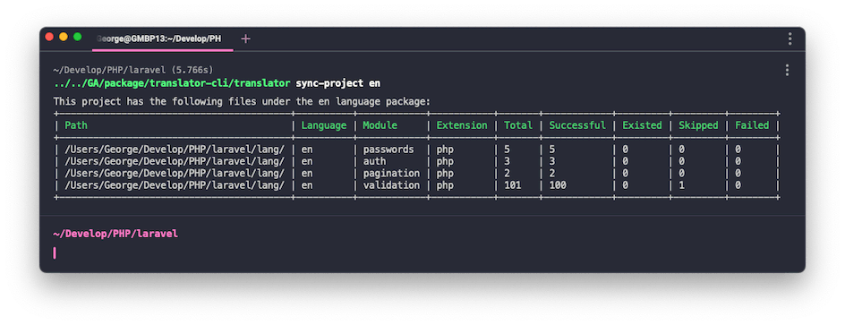

# Translator CLI

The CLI's role is to synchronize localized language files in both directions.

# Features

* Importing project language packages to the Translator service
* Export Translator translated language packs to your local project